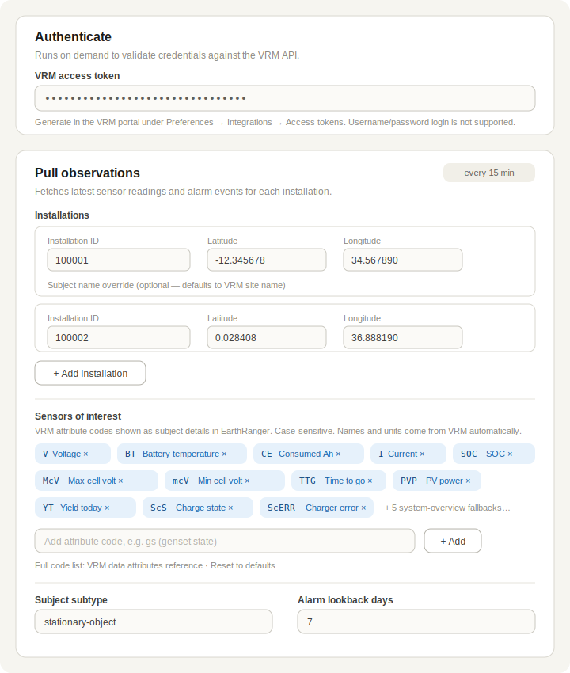

# Victron Energy connector — design

Jira: [GUNDI-5379](https://allenai.atlassian.net/browse/GUNDI-5379) · Detailed discovery notes: [CONNECTORS-544](https://allenai.atlassian.net/browse/CONNECTORS-544)
First customers: Ol Pejeta Conservancy, CSL Zambia.

## Overview

Victron Energy powers remote field infrastructure (radio repeaters, gates, camps) with solar/battery systems monitored through the [VRM cloud platform](https://vrm.victronenergy.com). This connector pulls from the VRM API and delivers to EarthRanger via Gundi:

- **Sensor readings → observations.** Each VRM installation becomes a **stationary subject** (fixed, configured location). The latest readings (battery voltage, state of charge, current, temperature, solar charger status…) travel in the observation `additional` and show up in the ER subject popup.
- **Alarms → events.** VRM alarms (low battery, device errors, no-data/communication loss, geofence, user-defined threshold alarms) become ER events at the installation's location.

Target UX (validated with a live demo site): subject group "Victron Energy", one subject per installation, popup listing the sensor readings, ~10-minute refresh.

## Scope — two phases

Delivery is split in two phases:

- **Phase 1 — Sensor readings (stationary subjects).** The `auth` action and a `pull_observations` action that reads the diagnostics endpoint per configured installation and sends observations to Gundi/ER. This covers the primary monitoring UX and is what the first customers validate.
- **Phase 2 — Event data (alerts).** A `pull_events` action mapping VRM alarm-log entries (`started`/`cleared`, device, description) to ER events, with a cursor persisted in the integration state, handling of active vs cleared alarms, and per-site alarm settings. Built after Phase 1 is validated with the first customers.

Sections below describe the full design; alarm/event material applies to Phase 2.

## VRM API summary

- Base: `https://vrmapi.victronenergy.com/v2` — [docs](https://vrm-api-docs.victronenergy.com/#/) (OpenAPI spec at `/docs/docs/openapi.yaml`)
- **Auth:** user-generated access token in header `x-authorization: Token <token>`. Username/password login is rejected for third-party API use (Bearer flow removed June 2026) — the connector must never ask for credentials.
- **Rate limit:** rolling window of 200 requests (~3 req/s sustained); 429 responses carry `Retry-After`.

Endpoints used:

| Endpoint | Purpose |
|---|---|
| `GET /users/me` | Validate token; obtain user id |
| `GET /users/{idUser}/installations?extended=1` | Site names, `last_timestamp`, active alarms (inline) |
| `GET /installations/{idSite}/diagnostics` | Latest value of every data attribute (sensor readings) |
| `GET /installations/{idSite}/alarm-log?start=&end=` | Historical alarm events with `started`/`cleared` |

### Why alarm-log rather than the diagnostics snapshot

The original prototype filtered alarm attributes out of `/diagnostics`. That is a point-in-time snapshot: an alarm that triggers and clears between two polls is never seen. `/alarm-log` keeps history with `started`/`cleared` timestamps, so a cursor persisted in the integration state guarantees no missed events, and lets us report both the alarm start and (optionally) its resolution.

## Actions

### `auth`
`AuthActionConfiguration` + `ExecutableActionMixin`. Single field: `token: pydantic.SecretStr` (password widget). Executes `GET /users/me`; stores the VRM user id in state for reuse.

### `pull_observations` (Phase 1)
`PullActionConfiguration`, `@crontab_schedule` every **10 minutes**. Per run:

1. `GET /users/{id}/installations?extended=1` — resolve site names, check freshness.
2. For each configured installation: `GET /installations/{id}/diagnostics` → filter by the sensors-of-interest whitelist → build **one observation**: configured lat/lon, `recorded_at` = newest record timestamp, `additional` = `{description: formattedValue}`.
3. `send_observations_to_gundi(...)`; return counts.

Requests are throttled/retried (`stamina` on 429/5xx honoring `Retry-After`) to respect the shared rate window — Ol Pejeta alone has 37 installations.

**Observation schema** follows the convention used by the OpenWeather and ZentraCloud connectors: `type: "stationary-object"` + `subtype` (default **`sensor`**, user-configurable — ER sites map icons per subtype). `source` = the VRM **`idSite`**, not the GX device `identifier` — the identifier is a hardware serial that changes when a gateway is replaced (observed at a real site), which would orphan the ER subject and its history.

**Partial-failure semantics:** one broken installation must not blind the healthy ones. Per-site failures are caught, the run continues, and failures are reported in the run summary and as throttled warnings.

**Activity logging** (portal feed is user-facing — log what a user can act on, throttle what repeats):
- *INFO*: run summary via return dict (`observations_extracted`, `installations_processed`, `installations_skipped`).
- *WARNING* (throttled to ~once/day per installation via the state manager): configured installation not visible to the account (wrong ID or wrong token); site skipped as stale (message includes last-data time); whitelisted sensor codes matching nothing anywhere (probable case typo).
- *ERROR*: VRM 401 (token revoked — message tells the user to generate a new token); persistent 5xx / rate-limit exhaustion; Gundi send failure.
- Debug detail (per-record drops, dedup decisions, successful retries) goes to stdout/GCP logs only, never the portal feed.

### `pull_events` (Phase 2)
`PullActionConfiguration`, own crontab schedule. Per configured installation: `GET /installations/{id}/alarm-log` from the state cursor (first run bounded by `alarm_lookback_days`) → map new entries to **events** (`title` from `description` + `nameEnum`, event time = `started`, location = configured lat/lon) → advance cursor → `send_events_to_gundi(...)`.

## Configuration

```python
class InstallationConfig(pydantic.BaseModel):
    installation_id: int          # visible in the VRM dashboard URL
    latitude: float               # ER subject location (VRM has no coordinates)
    longitude: float
    subject_name: Optional[str]   # defaults to the VRM site name

class PullObservationsConfig(PullActionConfiguration):   # Phase 1
    installations: List[InstallationConfig]
    subject_subtype: str = "sensor"          # user-configurable, ER maps icon
    sensors_of_interest: List[SensorCode] = [...]   # curated enum, default whitelist below
    additional_sensor_codes: List[str] = []  # free-text escape hatch for uncurated codes
    max_data_age_hours: int = 24             # site-level staleness cutoff (see Edge cases)

class PullEventsConfig(PullActionConfiguration):         # Phase 2
    alarm_lookback_days: int = 7             # first-run alarm-log window
```

**Sensor selection is hybrid:** `sensors_of_interest` is a curated enum (~20 known codes rendered as a multi-select with human-readable titles, e.g. "Voltage (V)", "Battery temperature (BT)"), while `additional_sensor_codes` is a free-text list for power users adding any other VRM attribute code. Both feed the same whitelist at runtime.

EarthRanger credentials/base_url are **never** stored here — they live on the destination integration and are resolved at runtime.

Portal form mock:



## Field mapping strategy

VRM diagnostics records are self-describing — the connector needs no hardcoded name/unit table:

| Record field | Used as |
|---|---|
| `code` | selection key (whitelist) |
| `description` | field name shown in ER ("Voltage", "State of charge") |
| `formattedValue` | field value shown in ER ("53.26 V", "95.0 %") |
| `Device`, `instance` | disambiguation / dedup |
| `timestamp` | staleness filter, observation `recorded_at` |

Default whitelist (matches the validated demo UX):

| Device | Codes |
|---|---|
| Battery Monitor | `V`, `BT`, `CE`, `I`, `McV`, `mcV`, `SOC`, `TTG` |
| Solar Charger | `PVP`, `YT`, `ScS`, `ScERR` |
| System overview (fallback) | `bv`, `bc`, `bs`, `Pdc`, `dc` |

Verified against both customer accounts: attribute codes and `idDataAttribute` are **global VRM definitions** — identical everywhere (`V`=47, `SOC`=51, `PVP`=442…). Availability varies only by hardware (cell voltages/temperatures require a lithium BMS). Adding a code in the portal makes the new reading appear in ER with its proper name and unit — no code change, no deploy.

## Edge cases (all observed in real customer data)

- **Codes are case-sensitive:** `BT` (battery temperature) ≠ `bt`; `McV` (max cell voltage) ≠ `mcV` (min).
- **Stale per-record timestamps:** one live site returns solar-charger records frozen at **2021** (replaced hardware) while its system-overview records are current. Records significantly older than the site's newest record (~1 h behind) are dropped, otherwise ER would present years-old readings as current. Note `recorded_at` honestly carries the reading time, so ER's "last update" never lies — this filter is about not mixing ancient values into a current-looking popup.
- **Dead sites:** several installations have sent nothing for years, some with permanent no-data alarms. A site whose newest data is older than `max_data_age_hours` (default 24, configurable) emits no observation and a throttled warning; it recovers automatically when data resumes.
- **Missing attributes:** whitelisted codes absent on a site (no BMS, no temp sensor) are skipped silently — each subject shows its own subset.
- **Duplicate readings:** the same quantity exists on multiple devices (Battery Monitor `V` vs System overview `bv`). Battery Monitor wins; System overview is the fallback.
- **Rate limiting:** many-site accounts fan out to 1–2 requests per site per poll; throttle and honor `Retry-After` on 429.

## Validation so far

- Both customer accounts exercised live (read-only) — token auth, installation listing, diagnostics, alarm-log.
- The demo site's ER popup (8 fields) was reproduced exactly by the whitelist strategy.
- A real active alarm was read from the alarm-log (`Solar Charger — Error code — #38 PV Input shutdown`, started 2025-12-30, still active).
- Reproduce with [`local/vrm_readings.py`](../local/vrm_readings.py): `VRM_TOKEN=<token> python3 local/vrm_readings.py [idSite ...]`
- **End-to-end PoC (2026-07-06):** [`local/vrm_to_gundi_poc.py`](../local/vrm_to_gundi_poc.py) pulls VRM diagnostics, shapes standard Gundi v2 observations, and POSTs them to the stage sensors API (`/v2/observations/` — trailing slash required, the redirect otherwise turns POST into GET). Verified with both accounts: single-site (Robin Pope, rendering correctly in stage ER at its real location with all readings) and multi-site batch (3 Ol Pejeta installations → 3 separate subjects, HTTP 200). Each installation is a separate `source` → separate ER subject.

## Open questions for the team

1. **Per-installation `subject_subtype`?** Currently one per connection (default `sensor`). Worth a per-installation override if e.g. repeaters and solar plants should carry different icons.
2. **Alarm-cleared events (Phase 2):** emit a second "resolved" event when `cleared` is set, or only alarm-start events?

(Resolved: readings and alarms are split into separate `pull_observations` / `pull_events` actions, delivered as Phase 1 and Phase 2 — see Scope. This also answers the "alarms toggle" question: customers that only want readings simply don't configure `pull_events`.)
